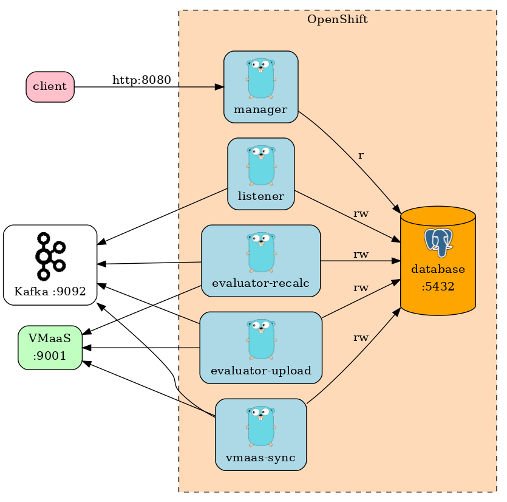

# patchman-engine
System Patch Manager application for [cloud.redhat.com](cloud.redhat.com).

## Architecture
The project is written as a set of communicating containers. The core components are `listener`, `evaluator`, `manager`, `vmaas_sync` and `database` 

### Components
- **manager** - Serves information about evaluated system advisories for given account via REST API.
- **listener** - Connects to kafka service, and listens for messages about newly uploaded hosts. When a new archive is
uploaded, it updates database system record with new package list and sends Kafka message to evaluate the system. I also
handles system deleting receiving delete events via Kafka.
- **evaluator-recalc** - Connects to kafka and listens for requests for evaluation from `vmaas_sync`. For each received
Kafka message it evaluates system with ID contained in the message. As a evaluation result it updates system-advisory pair
collection into the database.
- **evaluator-upload** - Same as the "-recalc" instance but receives Kafka messages from `listener`.
- **vmaas-sync** - Connects to [VMaaS](https://github.com/RedHatInsights/vmaas), and upon receiving notification about updated
data, syncs new advisories into the database, and requests re-evaluation for systems which could be affected by new advisories.
This component also performs system culling.
- **database** - Stores data about systems, advisories, system advisories and different related data.

### Schema

## Deploying
This project can be deployed either locally or in the cloud using openshift.

### Local deployment
Uses `podman-compose` to deploy the individual project components and supporting containers, which simulate the CMSfR platform and database respectively into local container instance:
~~~bash
podman-compose up --build # Build images if needed and start containers
podman-compose down       # Stop and remove containers
~~~

## Test local-running app
When podman compose is running, test app using dev shell scripts:
~~~bash
cd dev/scripts
./systems_list.sh         # show systems
./advisories_list.sh      # show advisories
./platform_sync.sh        # trigger vmaas_sync to sync (using vmaas mock)
./platform_upload.sh      # simulate archive upload to trigger listener and evaluator_upload
~~~

#### VMaaS
This project uses [VMaaS](https://github.com/RedHatInsights/vmaas) for retrieving information about advisories, and resolving which advisories can be applied to whic systems.
For local development, you need to clone VMaaS, and deploy it alongside this project.

## (Re)generate API docs
~~~bash
go get -u github.com/swaggo/swag/cmd/swag # download binary to generate, do it first time only
./scripts/generate_docs.sh
~~~

Test using Swagger, open <http://localhost:8080/openapi/index.html>.

## Run tests
~~~bash
podman-compose -f docker-compose.test.yml up --build --abort-on-container-exit
~~~

## Run vmaas_sync "sync" manually
There is a private API accessible only from inside of `vmaas_sync` container:
~~~
podman exec -it patchman-engine_vmaas_sync_1 ./sync.sh
~~~
