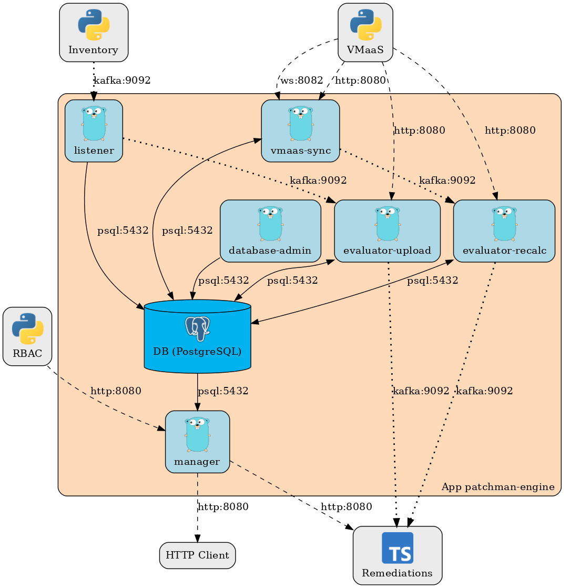

# Architecture
The project is written as a set of communicating containers. The core components are `listener`, `evaluator`, `manager`, `vmaas_sync` and `database` 

### Components
- **manager** - Serves information about evaluated system advisories for given account via REST API.
- **listener** - Connects to kafka service, and listens for messages about newly uploaded hosts. When a new archive is
uploaded, it updates database system record with new package list and sends Kafka message to evaluate the system. I also
handles system deleting receiving delete events via Kafka.
- **evaluator-recalc** - Connects to kafka and listens for requests for evaluation from `vmaas_sync`. For each received
Kafka message it evaluates system with ID contained in the message. As a evaluation result it updates system-advisory pair
collection into the database.
- **evaluator-upload** - Same as the "-recalc" instance but receives Kafka messages from `listener`.
- **vmaas-sync** - Connects to [VMaaS](https://github.com/RedHatInsights/vmaas), and upon receiving notification about updated
data, syncs new advisories into the database, and requests re-evaluation for systems which could be affected by new advisories.
This component also performs system culling.
- **database** - Stores data about systems, advisories, system advisories and different related data.

### Schema

