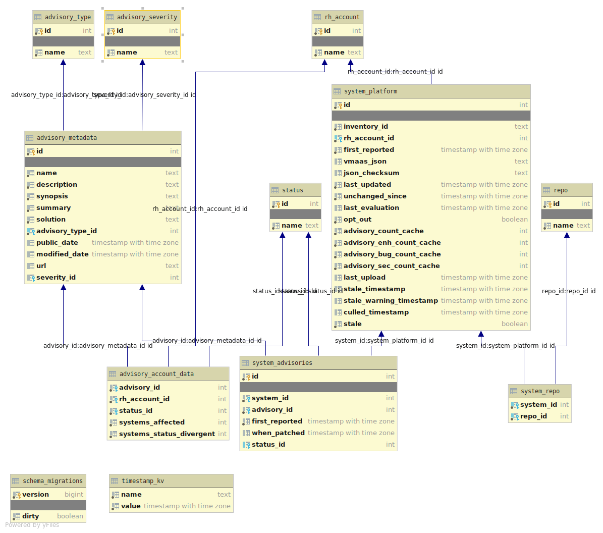

# Database

## Tables
Main database tables description:
- **system_inventory** — Partitioned table for the registered host / inventory profile: internal `id`, Insights `inventory_id`, `rh_account_id`, `vmaas_json` (packages, repos, modules for VMaaS), `yum_updates` and related checksums, staleness and culling timestamps, `display_name`, OS fields, tags/workspaces, and workload flags. **`system_repo`** (and similar link tables) use this internal `id` as the system key. The **listener** upserts rows here and relies on **system_inventory** for upload locks and unchanged detection; the **evaluator** reads it via a join to **system_patch**.
- **system_patch** — Partitioned evaluation output for each system, keyed by `rh_account_id` and `system_id` where `system_id` equals **system_inventory.id** on the same account. Holds advisory and package count caches, `last_evaluation`, `third_party`, `template_id`, and related aggregates. Rows are created or updated by the **listener** together with **system_inventory**; the **evaluator** persists evaluation results here (not into a single legacy table).
- **advisory_metadata** - stores info about advisories (`description`, `summary`, `solution` etc.). It's synced and stored on trigger by `vmaas_sync` component. It allows to display detail information about the advisory.
- **system_advisories** - stores info about advisories evaluated for particular systems (system - advisory M-N mapping table). `system_id` references **system_inventory.id**. Contains info when system advisory was firstly reported and patched (if so). Records are created and updated by `evaluator` component. It allows to display list of advisories related to a system.
- **advisory_account_data** - stores info about all advisories detected within at least one system that belongs to a given account. So it provides overall statistics about system advisories displayed by the application.
- **account_advisory** - workspace-scoped version of `advisory_account_data`. Stores per-advisory aggregate counts (`systems_applicable`, `systems_installable`) and notification state for each workspace within an account. Keyed by `(rh_account_id, workspace_id, advisory_id)`, partitioned by `rh_account_id` (32 partitions).
- **package_name** - names of the packages installed on systems
- **package** - list of all packages versions, precisely all EVRAs (epoch-version-release-arch)
- **system_package2** - list of packages installed on a system

## Schema
The ERD image below may lag `database_admin/schema/create_schema.sql`; for systems it may not reflect the split between **system_inventory** (host profile / upload payload) and **system_patch** (evaluation caches and aggregates).

